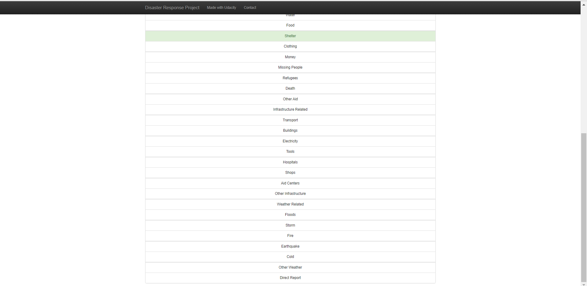

# **Disaster Response Classification Project**
This project aims to classify real time messages received from places where disaster is happening. These messages are collected in the real time and classified/directed towards relevant categories/departments of Disaster Response Team. The dataset from 'Figure Eight' has been used for this project.
In this project, the data was analyzed, cleaned and a classification model was built to classify the messages to relevant organizations.

# **Packages and Installations**
Clone the repository to run the project in local machine. Install the required dependencies listed below using pip, if not already installed.
The packages required to run the project are
- pandas
- sqlalchemy
- nltk
- scikit-learn
- pickle-mixin
- bz2file
- flask
- plotly
- joblib

##### Clone the git repository
`$ git clone`  
`$ cd disaster-response-project`  

##### Open command prompt  
`$ cd disaster-response-project`  
`$ pip install pandas sqlalchemy nltk scikit-learn pickle-mixin bz2file flask plotly joblib`  
`$ python data/process_data.py data/disaster_messages.csv data/disaster_categories.csv data/DisasterResponse.db`  
`$ python models/train_classifier.py DisasterResponse.db models/classifier.pkl`  
`$ cd app`  
`$ python run.py`  

  

The web URL for the web app will be "http://127.0.0.1:3001" just above WARNING

# **About files in the repository**  

1. The app folder contains another folder named 'templates' and one python script called 'run.py'   

  - In the templates folder there are two html files which have the content and structure of the web-app viz.  
    1. go.html
    2. master.html
  - The python script run.py contains flask web framework which is essential to launch the web page and some plotly graphs which are encoded in JSON.  

2. The data folder contains three files viz.
  - 'disaster_messages' which contains four columns viz.  
    1. id - Each message is associated with a specific id.
    2. message - Messages in english, received regarding disaster
    3. original - Messages in their original languages received, regarding disaster
    4. genre - The messages were classified into three genres viz. 'direct', 'news' and 'social'
  - 'disaster_categories' which has the data regarding which message is associated with which category. This dataset contains two columns,
    1. id - common column between two csv files, used to merge two datasets.
    2.  categories - A given message was classified into a single or multiple categories.
 - A python script named 'process_data.py' which contains python code that cleans the data for classification algorithm.  

3. 'models' folder contains only one python script named 'train_classifier.py' which contains python code that builds the model, evaluates it and saves the model in pickle format.

4. 'pictures' folder contains images of model results and web-app.

5. DisasterResponse.db file is the sqlite database which contains cleaned data from the process_data.py file.

6. RAEDME.md is the file which documents the details of the project.   

# **About Dataset**  
The dataset has been provided by Figure Eight.  
The dataset contains two csv files viz. 'disaster_categories.csv' and 'disaster_messages.csv'.   
1. The disaster_messages.csv file contains four variables viz.
- id - Each message is associated with specified id.
- message - Messages in english, received regarding disaster
- original - Messages in their original languages received, regarding disaster  
- genre - The messages were classified into three genres viz. 'direct', 'news' and 'social'  

2. The disaster_categories.csv file contains two variables viz.
- id - common column between two csv files, used to merge two datasets
- categories - A given message was classified into a single or multiple categories  

# **Imbalanced Dataset**  
Imbalanced datasets are those where observations associated with one class are far more greater in number than other classes.  
For example a medical facility has a dataset of patients regarding a particular disease. If the dataset contains 1000 observations/data points and out of those 1000 observations 950 observations belong to class 'no disease' class and 50 observations belong to 'disease' class, then that dataset is said to have class imbalance.  
##### Problems with Imbalanced dataset
- Since one class is far more greater in number than others, the classifier may get biased towards the class with majority of observations.

- Let's consider the above example about disease dataset and train a classifier on the dataset. After training, if we evaluate the model's performance on test set then, even if the model predicts all the observations as 'no disease', the model's accuracy will be 95% which is generally considered as very good, but choosing accuracy in this case as a metric to evaluate the model's performance will be invalid or irrelevant.
Hence we have to consider other metrics to evaluate these types of datasets.

- There are several ways to tackle data imbalance problem and in this project 'f1 score' and 'macro average' metrics were used to analyze the performance of the classifier.

# **Steps Taken to Clean the Dataset, Model Building and Model Evaluation**

##### Cleaning the dataset
Below are the steps taken to clean the dataset:
- After loading the above mentioned two datasets, these datasets were merged using the common variable 'id' and saved in the new variable 'df'.

- A new variable called 'categories_new' is created. Only the 'categories' column is extracted from 'df' variable and stored in new 'categories_new' variable.
- The 'categories_new' variable which consists only one column was split into 36 columns. After splitting the columns, they were named accordingly.
- From the 'df' dataset, 'categories' column was dropped and 'categories_new' variable was merged to it.
- Then all the duplicates were dropped from 'df' dataset and the cleaned dataset was saved into a sqlite database.

##### Model Buliding
Below are the steps taken to build the model:
- The data was retrieved from the database file and again stored in 'df' variable

- From the 'df' variable X and y values were extracted along with all the 36 category names which were stored in 'category_names' variable.
- A function named 'tokenize' was written to pre-process the input text data which takes only one argument called 'text'. The text preprocessing includes 'Normalization', 'Tokenization', 'Stop Word Removal' and 'Lemmatization'.
- Next a pipeline was built which includes `CountVectorizer(tokenizer=tokenize)`, `TfidfTransformer()` and `MultiOutputClassifier(RandomForestClassifier())`.
- A parameter grid was created to tune the hyper-parameters of the classifier using `GridSearchcv()` method.

##### Model Evaluation
- The model was then used to make predictions on test set and evaluated using `classification_report` from scikit-learn. The report shows various metrics in which f1-score and macro_avg can be used to measure the performance of the model.

- The the model is then saved in the pickle format.

# **License**

This project is released under [MIT License](https://choosealicense.com/licenses/mit/)

# **Screenshots of Web Page and Model Results**  

##### Model Results

#### Webpage Images

